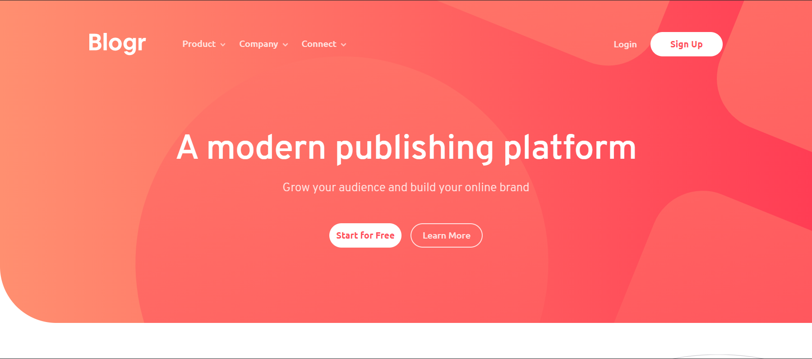

# Frontend Mentor - Blogr landing page solution

This is a solution to the [Blogr landing page challenge on Frontend Mentor](https://www.frontendmentor.io/challenges/blogr-landing-page-EX2RLAApP). Frontend Mentor challenges help you improve your coding skills by building realistic projects. 

## Table of contents

- [Overview](#overview)
  - [The challenge](#the-challenge)
  - [Screenshot](#screenshot)
  - [Links](#links)
- [My process](#my-process)
  - [Built with](#built-with)
  - [Continued development](#continued-development)
  - [Useful resources](#useful-resources)
- [Author](#author)

## Overview

### The challenge

Users should be able to:

- View the optimal layout for the site depending on their device's screen size
- See hover states for all interactive elements on the page

### Screenshot

### Links

- Solution URL: [Add solution URL here](https://your-solution-url.com)
- Live Site URL: https://paiput-blogr-landing-page.netlify.app/

## My process

### Built with

- Semantic HTML5 markup
- CSS custom properties
- Flexbox
- Desktop-first workflow

### Continued development

I have to learn a lot more about JavaScript, so that will be my focus for the next months.

### Useful resources

- [Fix Horizontal Scroll On Webflow](https://www.youtube.com/watch?v=w2Vcz3rik3E) - This video helped me to solve a problem with horizontal scroll with css.

## Author

Lucas Piputto

- Website - No Website yet
- Frontend Mentor - [@paiput](https://www.frontendmentor.io/profile/paiput)