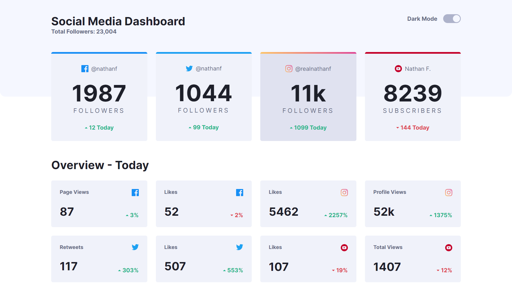

# Frontend Mentor - Social media dashboard with theme switcher solution

This is a solution to the [Social media dashboard with theme switcher challenge on Frontend Mentor](https://www.frontendmentor.io/challenges/social-media-dashboard-with-theme-switcher-6oY8ozp_H). Frontend Mentor challenges help you improve your coding skills by building realistic projects. 

## Table of contents

- [Overview](#overview)
  - [The challenge](#the-challenge)
  - [Screenshot](#screenshot)
  - [Links](#links)
- [My process](#my-process)
  - [Built with](#built-with)
  - [What I learned](#what-i-learned)
  - [Continued development](#continued-development)
  - [Useful resources](#useful-resources)
- [Author](#author)

## Overview

### The challenge

Users should be able to:

- View the optimal layout for the site depending on their device's screen size
- See hover states for all interactive elements on the page
- Toggle color theme to their preference

### Screenshot



### Links

- Solution URL: [Add solution URL here](https://your-solution-url.com)
- Live Site URL: https://paiput-social-media-dashboard.netlify.app/

## My process

### Built with

- Semantic HTML5 markup
- CSS custom properties
- Flexbox
- CSS Grid
- Desktop-first workflow

### What I learned

I learned about the `min()`, `max()`, and `clamp()` css functions, even though I only used the second one.

```css
.proud-of-this-css {
  color: max(2.222vw, 1.4rem); /* selects the largest value */
}
```

### Continued development

I will continue working on css and semantic html to make my web sites more accessible and better looking.

### Useful resources

- [YouTube video about min(), max() and clamp()](https://www.youtube.com/watch?v=U9VF-4euyRo) - Kevin Powell's video. He has tons of useful videos about semantic html and especially css.

## Author

- Frontend Mentor - [@paiput](https://www.frontendmentor.io/profile/paiput)
- Twitter - [@paiput_](https://www.twitter.com/paiput_)